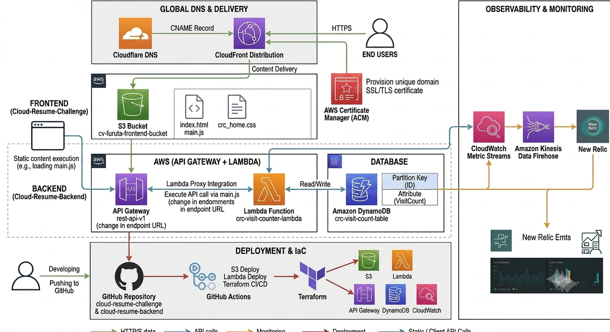

# Cloud Resume Challenge 

AWS, Terraform, GitHub Actionsを活用した、サーバーレスな履歴書公開プロジェクトです。 手動での構築（ClickOps）を卒業し、Infrastructure as Code (IaC)と CI/CD パイプラインを完全自動化したモダンな構成を採用しています。 

## 🚀 プロジェクトの概要 
このプロジェクトは、静的Webサイト（ポートフォリオ）をAWS上にセキュアかつ高速に配信する仕組みを構築したものです。
単なるファイルのアップロードではなく、エンジニアリングのベストプラクティスを盛り込むようにしています。 

### 主な特徴 
- IaC (Terraform): インフラの全設定をコードで管理。再現性の高い環境構築を実現。 
- CI/CD (GitHub Actions): コードの変更を検知し、自動的にS3への同期とCloudFrontのキャッシュクリアを実行。 
- Security: Origin Access Control (OAC) を使用し、S3バケットへの直接アクセスを遮断。CloudFront経由の通信のみを許可。 
- Edge Computing: CloudFrontを利用した低遅延なコンテンツ配信。 



## 🛠️ 使用技術 (Tech Stack) 
| Category | Technology | 
| :--- | :--- | 
| Cloud | Amazon Web Services (S3, CloudFront, IAM) | 
| IaC | Terraform | 
| CI/CD | GitHub Actions | 
| Frontend | HTML5, CSS3 | 

## 📂 ディレクトリ構成 
```text
.
├── .github/workflows/    # CI/CD パイプライン（deploy.yml）
├── infra/                # Terraform 構成ファイル（.tf）
│   ├── provider.tf       # AWS プロバイダー設定
│   └── main.tf           # S3, CloudFront, Policy の定義
├── index.html            # 履歴書本体（HTML）
└── style.css             # スタイルシート（CSS）
```

## ⚙️ CI/CD パイプラインのフロー 
1. ローカルで `index.html` または `style.css` を編集。 
2. `git push origin main` を実行。 
3. GitHub Actions が起動。 
- AWS 認証情報を安全にセットアップ（GitHub Secrets を利用）。 
- `aws s3 sync` で差分ファイルを S3 へアップロード。 
- `aws cloudfront create-invalidation` でキャッシュを即時更新。 


## 🔧 セットアップと実行 

前提条件
- Terraform インストール済み
- AWS 認証情報の設定（IAMユーザー: `terraform-user`）

```powershell
# インフラディレクトリへ移動
cd infra
# 初期化と実行
terraform init
terraform plan
terraform apply
```

## 🔗 DNS設定（Cloudflare）

DNS records

サイトを安全な通信に公開するため、以下の2つのレコードを設定。
| タイプ | 名前（ホスト名） | ターゲット（値） | プロキシステータス | 役割 / 備考 |
| :--- | :--- | :--- | :--- | :--- |
| CNAME | `furuta-resume.com` | `d1gubyjmitr30b.cloudfront.net` | DNS only | Webサイト表示用（CloudFrontへ接続） |
| CNAME | `_61b...furuta-resume.com | `_66...acm-validations.aws | DNS only | SSL証明書の自動検証・更新用（※非公開情報） |

## 🔐 Multi-Account & SSO
本プロジェクトでは、AWS のベストプラクティスに基づき、AWS Organizations を利用したマルチアカウント戦略を採用しています。
これにより、環境間の完全な分離と、AWS IAM Identity Center (SSO)によるセキュアかつ効率的なアクセス管理を実現しています。 
| アカウント名 | 役割 | 認証・管理内容 | 
| :--- | :--- | :--- | 
| Management_Ac | 組織統制・支払い | AWS Organizations の管理親アカウント。IAM Identity Center (SSO) を有効化し、全環境へのシングルサインオンを一元管理。 | 
| crc_Prod | 本番環境 | 本番用ワークロード。Terraform + GitHub Actions による CI/CD パイプラインのみが変更権限を持つ。 | 
| crc_Test | 検証環境 | サンドボックス / ステージング環境。手動による ClickOps 検証や新機能のリサーチに使用。 | 

認証とセキュリティ概要
- シングルサインオン (SSO): IAM Identity Center を利用することで、1つの認証情報で複数の AWS アカウントへ安全にスイッチロールが可能。 
- 最小権限の原則: 管理アカウントに直接ログインする機会を最小限に抑え、各環境（Prod/Test）には必要な権限のみを付与した Permission Sets を適用。 
- ガバナンス: 一括請求 (Consolidated Billing) により、個人プロジェクトとしてのコスト管理を Management Account で透明化。 

## 👨‍💻 作成者
- Ousuke Furuta
- Infrastructure Engineer 

## 📚 References
- Cloud Resume Challenge Official Website - https://cloudresumechallenge.dev/
